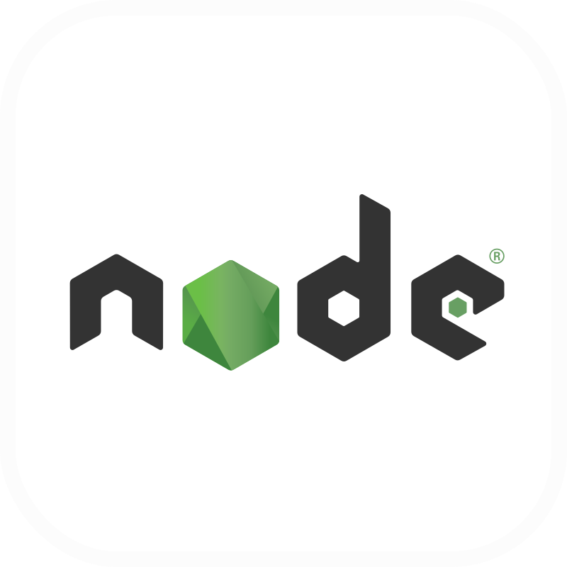
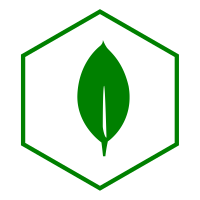
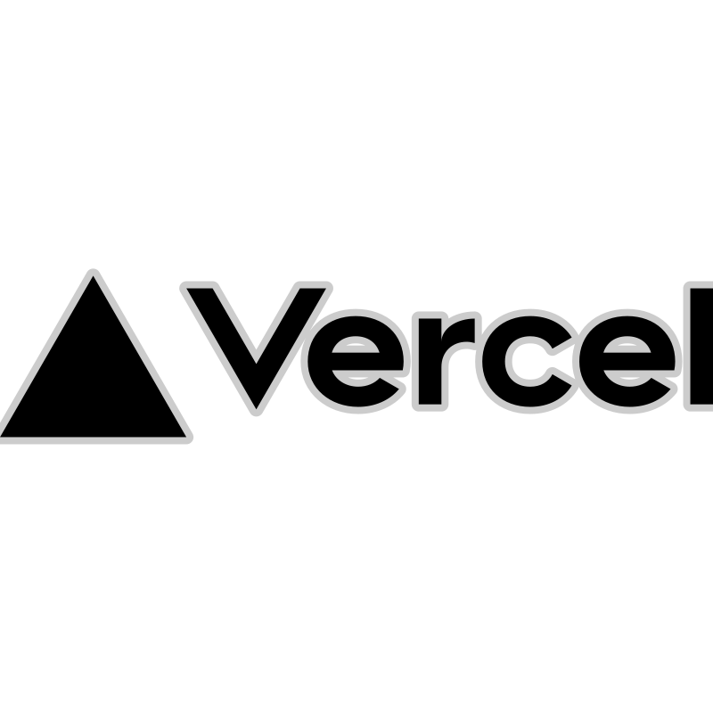

## 🖖 About me:

Hi, I’m @chill-peppa.  I’m a beginner frontend developer from St.Petersburg, Russia.

- At the moment I’m studying typescript and redux. Also I’m studying React in depth.
- I’m writing a training project [Stellar Burgers](https://github.com/Chill-Peppa/react-burger)
- If I have free time, then I’m working on a project [Portal ECB](https://github.com/Chill-Peppa/antdesign)

## 🛠️ Technologies and Tools:

 

## 📂 Portfolio:

(тут потом будет ссылка на мое портфолио)

## 📊 Profile stats:

## 📧 My contacts for communication:

  
  

