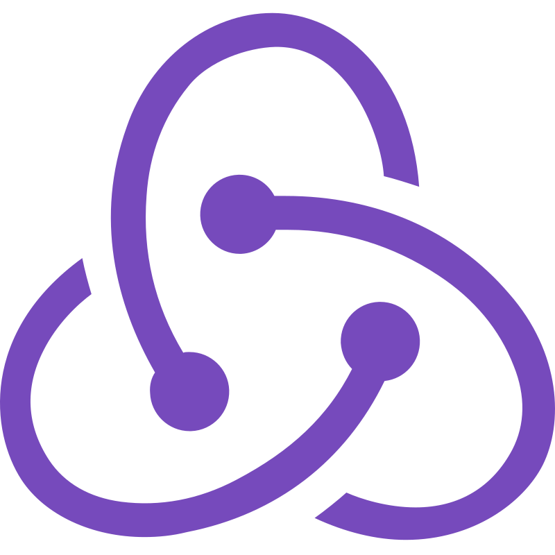
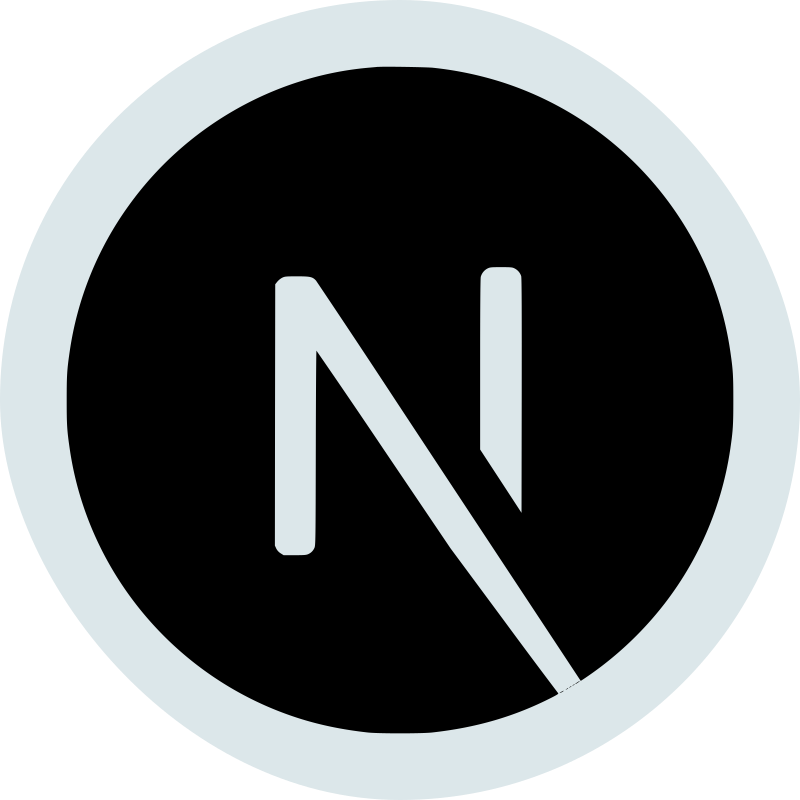

## 🖖 About me:

Hi, I’m @chill-peppa.  I’m a beginner frontend developer from St.Petersburg, Russia.

- At the moment I’m studying Next.js and Redux Toolkit. Also I’m studying React in depth.
- I’m regularly solving katas on Codewars
- If I have free time I’m working on a pet-project [E-pass](https://github.com/e-pass/web).
- If you want communicate with me just write to me on [telegram](https://t.me/chill_peppa).

## 🛠️ Technologies and Tools:

 

## 📂 Portfolio:

(когда-нибудь я сделаю красивое портфолио и выложу его сюда...)

## 📊 Profile stats:

